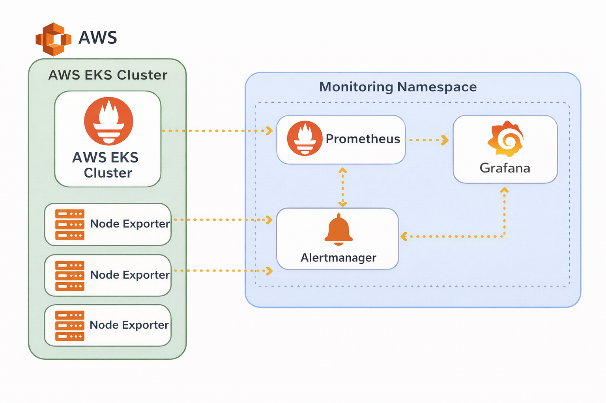
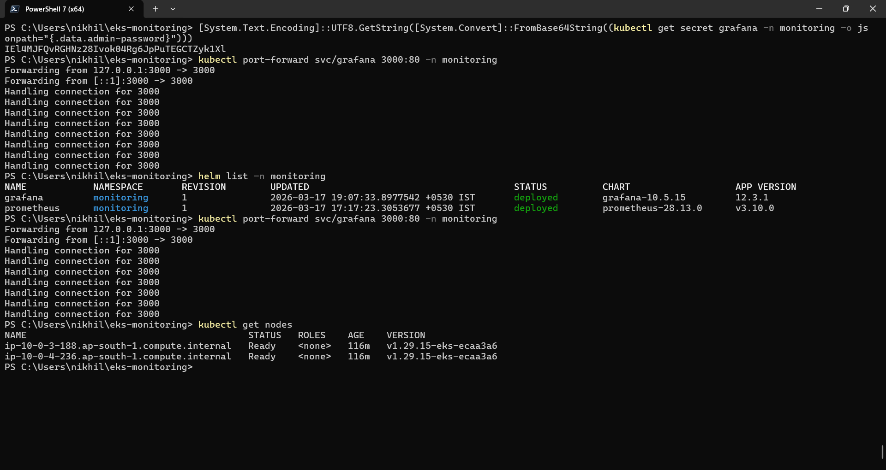
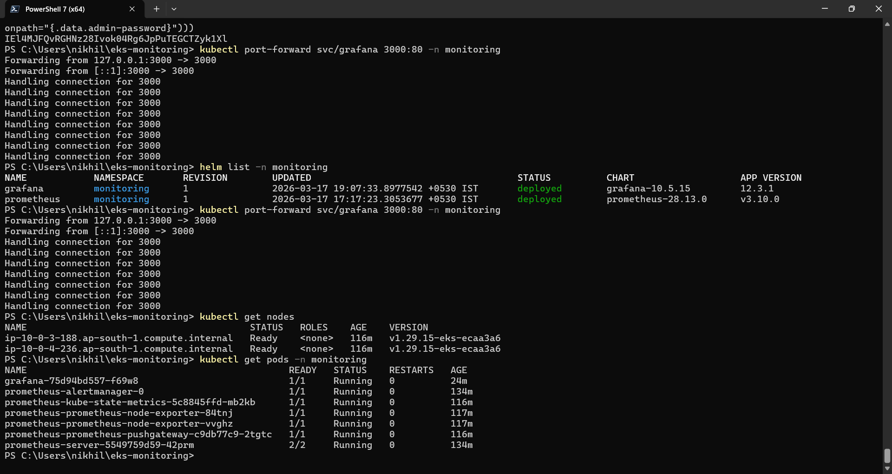
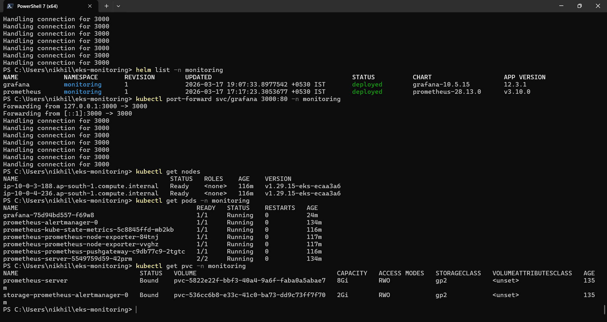
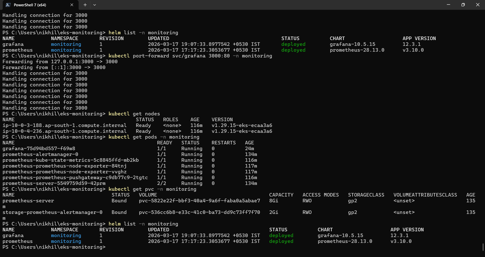
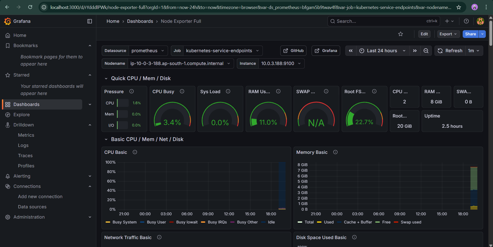
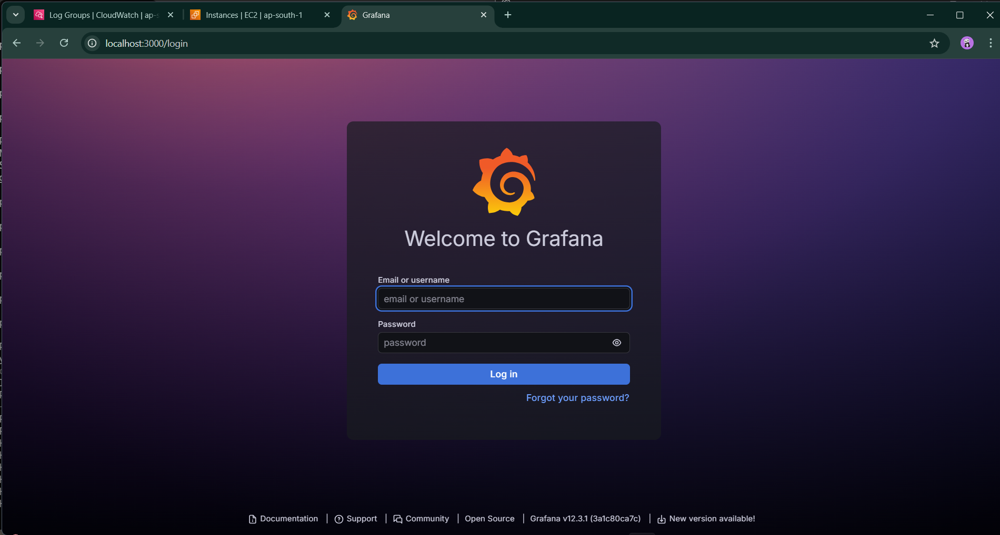
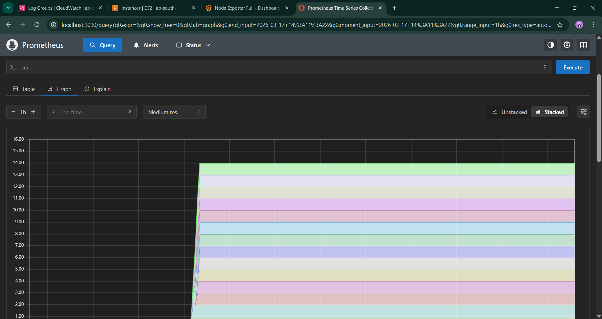

# 🚀 Deploy Prometheus & Grafana on Kubernetes (EKS) using Terraform & Helm

---

## 📌 Project Overview

This project demonstrates how to deploy a **complete monitoring stack** on a Kubernetes cluster using **Infrastructure as Code (IaC)** tools.

A Kubernetes cluster was provisioned on AWS using **Terraform**, and monitoring tools **Prometheus** and **Grafana** were deployed using **Helm**.

The system enables real-time monitoring, alerting, and visualization of Kubernetes workloads and infrastructure.

---

## 🎯 Objectives

* Provision Kubernetes cluster using Terraform (AWS EKS)
* Deploy Prometheus for metrics collection
* Deploy Grafana for visualization
* Configure persistent storage using AWS EBS (CSI Driver)
* Connect Prometheus to Grafana
* Visualize cluster metrics using dashboards

---

## 🏗️ Architecture



---

## 🧠 Key Concepts

### 🔹 Terraform (Infrastructure as Code)

Terraform was used to automate the provisioning of:

* AWS VPC
* Subnets
* EKS Cluster
* Node Groups

---

### 🔹 Kubernetes Monitoring

Prometheus collects metrics from Kubernetes components, and Grafana visualizes them using dashboards.

---

### 🔹 Helm

Helm simplifies deployment of Prometheus and Grafana using charts.

---

### 🔹 Prometheus

Collects and stores time-series metrics using PromQL.

---

### 🔹 Grafana

Used to visualize metrics and build dashboards.

---

### 🔹 EBS CSI Driver & IRSA

Used for dynamic storage provisioning and secure AWS access.

---

## ⚙️ Prerequisites

* AWS Account
* Terraform
* AWS CLI
* kubectl
* Helm

---

## 🚀 Deployment Steps

### 1️⃣ Provision EKS Cluster

```bash
terraform init
terraform apply
```

---

### 2️⃣ Configure Kubernetes Access

```bash
aws eks update-kubeconfig --region ap-south-1 --name monitoring-cluster
```

---

### 3️⃣ Verify Cluster

```bash
kubectl get nodes
```

📸


---

### 4️⃣ Add Helm Repositories

```bash
helm repo add prometheus-community https://prometheus-community.github.io/helm-charts
helm repo add grafana https://grafana.github.io/helm-charts
helm repo update
```

---

### 5️⃣ Deploy Prometheus

```bash
helm install prometheus prometheus-community/prometheus --namespace monitoring --create-namespace
```

---

### 6️⃣ Deploy Grafana

```bash
helm install grafana grafana/grafana --namespace monitoring
```

---

### 7️⃣ Verify Pods

```bash
kubectl get pods -n monitoring
```

📸


---

### 8️⃣ Verify Storage (PVC)

```bash
kubectl get pvc -n monitoring
```

📸


---

### 9️⃣ Helm Releases

```bash
helm list -n monitoring
```

📸


---

### 🔟 Access Grafana



```bash
kubectl port-forward svc/grafana 3000:80 -n monitoring
```

📸


---

### 1️⃣2️⃣ Prometheus UI/Dashboard

📸



---

## ⚠️ Challenges Faced

* EKS access issues
* IAM configuration issues
* PVC pending state
* CSI driver crash

---

## ✅ Solutions

* Enabled public access
* Configured IAM roles
* Installed CSI driver
* Used IRSA

---

## 🎯 Benefits

* Terraform → infrastructure automation
* Helm → application deployment
* Combined → scalable & reproducible

---

## 📌 Conclusion

This project demonstrates real-world Kubernetes monitoring using modern DevOps tools.

---

## 👨‍💻 Author

**Nikhil Khandare**
